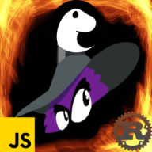
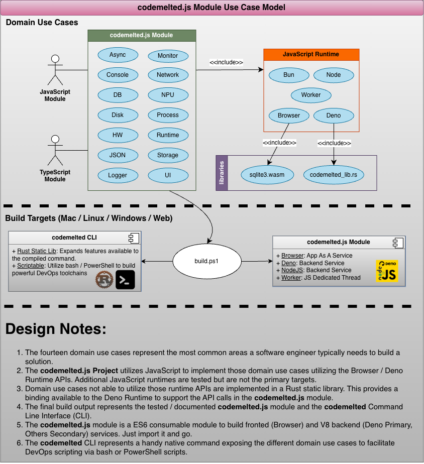
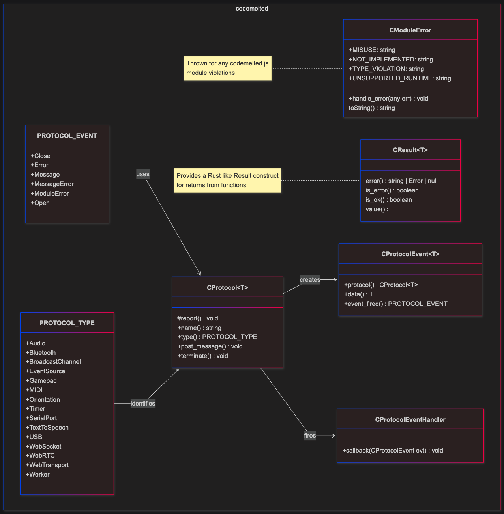

  
  <h1>Object-Oriented Analysis and Design (OOAD)</h1>

**Table of Contents**

- [INTRODUCTION](#introduction)
  - [Purpose](#purpose)
  - [Scope](#scope)
  - [Terms](#terms)
  - [References](#references)
    - [C++ Reference](#c-reference)
    - [Mozilla Developer Network (MDN)](#mozilla-developer-network-mdn)
    - [Rust STD](#rust-std)
    - [web.dev](#webdev)
- [FUNCTIONAL ANALYSIS](#functional-analysis)
  - [UC-1: Function Feature](#uc-1-function-feature)
- [NON-FUNCTIONAL ANALYSIS](#non-functional-analysis)
  - [Useability](#useability)
  - [Reliability](#reliability)
  - [Performance](#performance)
  - [Supportability](#supportability)
  - [Design Constraints](#design-constraints)
  - [Documentation](#documentation)
  - [Purchased Components](#purchased-components)
  - [Licensing and Security](#licensing-and-security)
  - [Legal, Copyright and Other Notices](#legal-copyright-and-other-notices)
  - [Applicable Standards](#applicable-standards)
  - [Internationalization and Localization](#internationalization-and-localization)
  - [Physical Deliverables](#physical-deliverables)
  - [Installation and Deployment](#installation-and-deployment)
- [DESIGN ANALYSIS](#design-analysis)
  - [Communication Interfaces](#communication-interfaces)
  - [Hardware Interfaces](#hardware-interfaces)
  - [Software Interfaces](#software-interfaces)
    - [Module Core](#module-core)
    - [Domain Use Case Implementation](#domain-use-case-implementation)
  - [User Interfaces](#user-interfaces)
- [TRACEABILITY](#traceability)

# INTRODUCTION

## Purpose

<mark>The purpose outlines the reason for creating the process. It answers the question “why is this being done?” and provides direction, motivation, and clarity for all stakeholders involved. A well-defined purpose sets the overarching goals and desired outcomes, ensuring that everyone understands the intent behind the document.</mark>

## Scope

<mark>The scope specifies the boundaries, extent, and limitations of the process. It answers “what is included and what is excluded?” and defines the deliverables, tasks, responsibilities, and areas covered. Scope ensures that the project remains focused and manageable, preventing unnecessary expansion or deviation from the original goals.</mark>

## Terms

<mark>Breakdown of acronyms and definitions</mark>

## References

The following are the references to the external Browser / Deno APIs that were wrapped to create the `codemelted.js` module.

### C++ Reference

- [C++ Future](https://en.cppreference.com/cpp/thread/future)

### Mozilla Developer Network (MDN)

- [Beacon](https://developer.mozilla.org/en-US/docs/Web/API/Beacon_API)
- [Bluetooth](https://developer.mozilla.org/en-US/docs/Web/API/Bluetooth)
- [Broadcast Channel](https://developer.mozilla.org/en-US/docs/Web/API/Broadcast_Channel_API)
- [CookieStore](https://developer.mozilla.org/en-US/docs/Web/API/CookieStore)
- [Console](https://developer.mozilla.org/en-US/docs/Web/API/console)
- [EventSource](https://developer.mozilla.org/en-US/docs/Web/API/EventSource)
- [EventTarget](https://developer.mozilla.org/en-US/docs/Web/API/EventTarget)
- [Fetch](https://developer.mozilla.org/en-US/docs/Web/API/Fetch_API)
- [File System](https://developer.mozilla.org/en-US/docs/Web/API/File_System_API)
- [Geolocation](https://developer.mozilla.org/en-US/docs/Web/API/Geolocation_API)
- [Input File](https://developer.mozilla.org/en-US/docs/Web/HTML/Reference/Elements/input/file)
- [localStorage](https://developer.mozilla.org/en-US/docs/Web/API/Window/localStorage)
- [Location](https://developer.mozilla.org/en-US/docs/Web/API/Location)
- [HTMLAnchorElement Download](https://developer.mozilla.org/en-US/docs/Web/API/HTMLAnchorElement/download)
- [Navigator](https://developer.mozilla.org/en-US/docs/Web/API/Navigator)
- [Promise](https://developer.mozilla.org/en-US/docs/Web/JavaScript/Reference/Global_Objects/Promise)
- [Screen](https://developer.mozilla.org/en-US/docs/Web/API/Screen)
- [sessionStorage](https://developer.mozilla.org/en-US/docs/Web/API/Window/sessionStorage)
- [USB](https://developer.mozilla.org/en-US/docs/Web/API/USB)
- [Using Custom Elements](https://developer.mozilla.org/en-US/docs/Web/API/Web_components/Using_custom_elements)
- [Web Serial](https://developer.mozilla.org/en-US/docs/Web/API/Web_Serial_API)
- [Web MIDI](https://developer.mozilla.org/en-US/docs/Web/API/Web_MIDI_API)
- [WebSocket](https://developer.mozilla.org/en-US/docs/Web/API/WebSocket)
- [WebRTC](https://developer.mozilla.org/en-US/docs/Web/API/WebRTC_API)
- [WebTransport](https://developer.mozilla.org/en-US/docs/Web/API/WebTransport)
- [Window](https://developer.mozilla.org/en-US/docs/Web/API/Window)
- [Worker](https://developer.mozilla.org/en-US/docs/Web/API/Worker)

### Rust STD

- [Result](https://doc.rust-lang.org/std/result/)

### web.dev

- [web.dev: Save a File](https://web.dev/articles/files/save-a-file)

# FUNCTIONAL ANALYSIS

<mark>An introductory use case model or other architecture diagram that may aid in visualizing the different requirements categories below.</mark>

<mark>Add a new model for each complex Function Feature that may need further pictorial and feature breakdown until it is at its lowest testable functional description.</mark>

## UC-1: Function Feature

<mark>IF Describing via Behavioral Driven Development (BDD) User Story Format</mark>

- **Description:** As a [who], I want [what], so that [why].
- **Scenario 1:** Describe the scenario
    - *Given:* Sets up the initial context, state, or preconditions of the system before any action happens.
    - *When:* Describes the specific action, event, or trigger performed by the user or system.
    - *Then:* Specifies the expected observable outcome or response after the action.
    - *And:* Extends any of the previous statements to add positive or multiple conditions, actions, or results.
    - *But:* Adds a negative condition, exception, or contrasting limitation to the preceding steps
- **Scenario 2:** Describe the scenario
    - *Given:* Sets up the initial context, state, or preconditions of the system before any action happens.
    - *When:* Describes the specific action, event, or trigger performed by the user or system.
    - *Then:* Specifies the expected observable outcome or response after the action.
    - *And:* Extends any of the previous statements to add positive or multiple conditions, actions, or results.
    - *But:* Adds a negative condition, exception, or contrasting limitation to the preceding steps

<mark>IF Describing via Use Case Scenario Format:</mark>

- **Description:** A description of what this use case is all about.
- **Actors:** Who / what is triggering this use case.
- **Trigger:** The ideal setup necessary for the use case scenario to run.
- **Main Success Scenario:** The primary, ideal sequence of steps where everything goes right and the user achieves their goal without errors
- **Alternate Flows:** Different paths or optional behaviors that still lead to success (e.g., a customer pays with PayPal instead of a credit card)
- **Exception Flows:** Paths handling errors, invalid inputs, or system failures (e.g., a declined credit card or an out-of-stock item)
- **Post-Condition:** The expectation when the main success scenario completes.

<mark>IF Describing via EARS Function Requirements Format:</mark>

- Ubiquitous (Always Active): The <system name> shall <system response> (e.g., The mobile phone shall have a mass of less than 150 grams
- State-Driven (Active During a State): While <state>, the <system name> shall <system response> (e.g., While the vehicle is in reverse, the system shall display the rear camera feed)
- Event-Driven (Triggered by an Event): When <trigger>, the <system name> shall <system response> (e.g., When the user presses the power button, the device shall turn on)
- Optional Features: Where <feature is present>, the <system name> shall <system response> (e.g., Where the navigation package is installed, the system shall display the map)
- Unwanted Behavior: If <unwanted trigger>, then the <system name> shall <system response> (e.g., If the password is entered incorrectly three times, then the system shall lock the account)

# NON-FUNCTIONAL ANALYSIS

## Useability

<mark>State the requirements that affect usability.</mark>

## Reliability

<mark>State the requirements for reliability</mark>

## Performance

<mark>State the performance characteristics of the system, expressed quantitatively where possible and related to use cases where applicable.</mark>

## Supportability

<mark>State the requirements that enhance system supportability or maintainability</mark>

## Design Constraints

<mark>State the design or development constraints imposed on the system or development process.</mark>

## Documentation

<mark>State the requirements or user and/or administrator documentation.</mark>

## Purchased Components

<mark>List the purchased components used with the system, licensing or usage restrictions, and compatibility/interoperability requirements</mark>

## Licensing and Security

<mark>Describe the licensing and usage enforcement requirements or other restrictions for usage, security, and accessability</mark>

## Legal, Copyright and Other Notices

<mark>Describe the licensing and usage enforcement requirements or other restrictions for usage, security, and accessibility.

## Applicable Standards

<mark>Reference any applicable standards and the specific sections of any such standards that apply.</mark>

## Internationalization and Localization

<mark>State any requirements for support and application of different user languages and dialects</mark>

## Physical Deliverables

<mark>Define any specific deliverable artifacts required by the user or customer</mark>

## Installation and Deployment

<mark>Describe any specific deliverable artifacts required by the user or customer</mark>

# DESIGN ANALYSIS

<mark>Define the interfaces that must be supported by the application. Utilize necessary UML and modeling definitions to reflect it.</mark>

## Communication Interfaces

## Hardware Interfaces

## Software Interfaces

### Module Core

### Domain Use Case Implementation

- [Async](./async.md)

## User Interfaces

# TRACEABILITY

<mark>Fill out table of the different elements showing how they relate.</mark>

| REQ # | DESIGN # |
| ----- | -------- |
